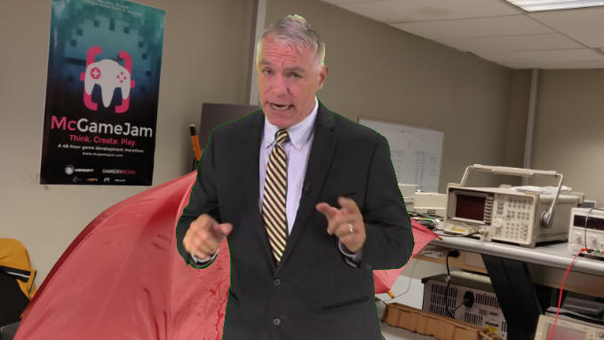

## 🤔 What's this?

Good question! Although we're nearing the end of our second year as a club at McGill, our [itch.io](http://gamedevmcgill.itch.io/) account has been our only online footprint so far. This all changes with the official release of our new website!

Going forward, this bad boy is going to serve as a way for us to let people know that we exist, give context on what we're doing, and showcase the fruits of our labor as budding game developers. That said...

### 🚨 Attention all GDM members:

  

The Factory has a leaky ceiling, and Élie needs your help to get sponsorship money to buy out the upstairs tenants who leave their sinks running.

But to do this, he needs to show off that our club actually does stuff, and a couple of our members' games to showcase.

To help him, all he needs is for you to log into your itch.io account, go to your game's settings, and add `gamedevmcgill` as a Project Admin on your game.

But, you gotta be quick so that Élie can secure the bag and achieve the GAME... INDUSTRY... SPONSORSHIP.

...

All that to say that if you're a member and you wanna show off your games, please add us as an admin on your game! This is so that we can query the game data with the [itch.io serverside API](https://itch.io/docs/api/serverside), which only has an endpoint for `my-games`. Go figure. We pinky swear that we won't do anything malicious. 😇

## 🤓 (Also, cool website, how did you make it?)

Glad you asked. In case anyone actually cares, I think the tech stack on the site is super cool. It's built using [GatsbyJS](https://www.gatsbyjs.org/), which means that everything (including this blog) is fully static and blazing fast 🔥. If you want to see the code (or report any bugs), we have the whole GitHub repository available [here](https://github.com/gamedevmcgill/website).

I'd like to also mention that everything on this site was made bespoke. **A big shout-out goes to our resident pixel art expert Jack Xie for making the gorgeous pixel art banner hanging in the hero of the landing page.**

## 🔮 What's next?

Well, we'll first want to get your games up on the home page! However, we only have limited space on there, so we'd like to have a separate page with a full game catalog. Moreover, we'd like to post more information on what the membership entails, and more details on our club space in The Factory and all the cool stuff we have there!

As for this blog, McGame Jam 2019 is right around the corner, so we'll hopefully be able to write about that! **Also, stay tuned for new executive member positions available for next year!**. About half of the current executives are graduating, so we're definitely looking for fresh faces to make our club even better!
