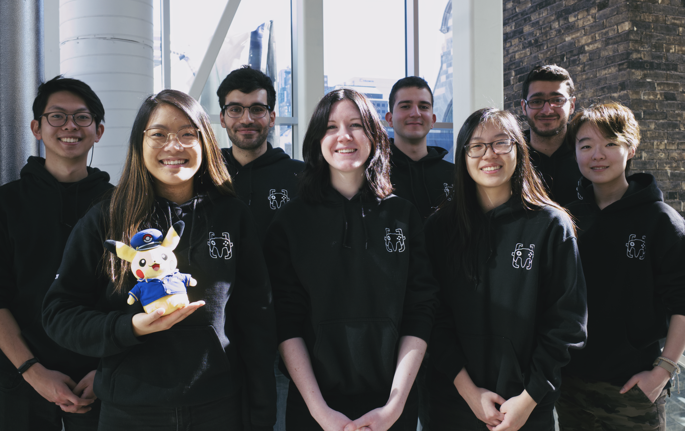

## 👩‍🎓 Goodbye old execs!

Spring is coming 🌷 and that means that the end (of another academic year) is near. Some of us are (hopefully) graduating and won't be around next year. With half of the exec team gone, this leaves plenty of positions empty along with new positions to be filled on our committee.

## ☀️ Hello new execs!

Are you looking to get involved in a community of students passionate about game development? If so, apply to become an exec of GameDev McGill. We are looking to fill the following positions:

- VP Communications
- VP Admin
- VP Internal
- VP External
- 2x Assistant Programmer

Note: Applicants must still be students for the entirety of the 2019-2020 academic year.

## 🧐 How do I apply?

You can read the role descriptions below to know more about each of them. Then, fill out the following form https://goo.gl/forms/nsJtTOySYbsT0pyU2 by Thursday the 28th of March, after which we will schedule interviews with all applicants.

### ✏️ VP Communications

The VP communications is responsible for creating all of the content used for our social media, website, and events. They are responsible for the overall perception of the club and its events by students and sponsors. They also ensure engagement of our members in our Discord channel, and provide avenues for our members to feel a part of the community.

**Requirements**

- Strong and creative written English skills (French is a plus!)
- Experience with creating media
- Good time management skills
- Experience building and engaging a community is a plus

### 📦 VP Admin

The VP Admin is responsible for managing all of GameDev McGill's physical assets such as inventory management and equipment rental. They are also the primary liaison to ECSESS and The Factory when it comes to matters dealing with the club space. In addition, the VP Admin also creates initiatives, whether it be through events or new equipment, to improve member involvement in our club space. Current equipment includes: game dev books, controllers, a VR headset, gaming laptop, and a gaming PC.

**Requirements**

- Strong organization skills
- Experience using Excel or Airtable
- Experience with computer hardware is a plus
- Experience managing inventory is a plus

### 🎉 VP Internal

The VP Internal is responsible for the organization of all internal club events. These events include: our monthly game dev socials and game jams, watch and learns, and tutorials/workshops. These events are primarily targeted at our members, and are one of our club's primary means of building our community. They make sure that all of our events are executed properly!

**Requirements**

- Strong organizational and scheduling skills
- Desire to host awesome game dev events!

### ✈️ VP External

The VP External is responsible for communication with external entities. They organize events with our sponsors such as industry tours, talks, and panels with industry professionals. The primary initiative they will be undertaking next year is to expand GameDev McGill's sponsors by creating comprehensive sponsorship packages. This is crucial since we require sponsorships to fund all of our club's activities including McGame Jam. In addition, the VP External is responsible for coordinating events with other student clubs, i.e., cross-club events.

**Requirements**

- Strong and professional written English skills (French is a plus!)
- Ability to create interesting sponsor packages
- Experience managing events is a plus
- Experience working in a public relations position is a plus

### 💻 Associate Programmer (2)

We are looking for **TWO** associate programmers!

The Associate Programmers work alongside the Lead Programmer to manage all technical events in the club, such as workshops, tutorials, and projects. They will also act as a resource for our members looking for technical help. Our initiative for next year is to create a new beginner's workshop series that will introduce our new members to the foundations of game development and set them on a path to build their first games. In addition to workshops given throughout the semester, the Associate Programmers will also revamp the club's introduction tutorial that all members must complete in order to join the club.

**Requirements**

- Game development experience (ideally in Unity or Unreal)
- Experience with presenting technical tutorials or talks is preferred
- Experience planning and executing projects on a longer timescale is preferred

