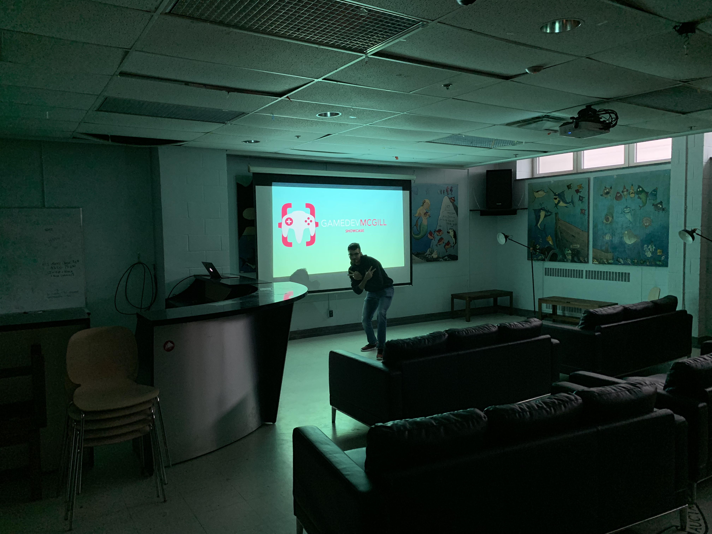

# 🎩 It's showtime!

Don't be fooled by the snow outside; it's definitely April. Although we aren't graced with the usual balmy spring weather, we're still getting to the end of the school year. 2018-2019 was our second year as GameDev McGill, and as the club has grown over the past four semesters, so have all of our members. With the end right around the corner, we wanted to have a public event to highlight the efforts that we've put into our craft!

  

What ended up happening? Last Tuesday, we booked the EUS Common Room, ordered a bunch of pizza and snacks, and invited everyone to come play the dozen or so games that we had completed over the past school year! It was inspiring to see everyone's creativity come to life, and even cooler to see how their games spanned a whole gamut of genres.

Platformer? Check! Racer? Check! Bullet hell? Check! Horror? Check! Quick-time action theatre stage dressing game with Twitch chat integration? Check! You get the idea...

  

Aside from the demos, we also had all the presenters come up in front of the whole audience for a few minutes to give some context on their ideas and how they made them come to life!

  

# 🏆 Winner?

At the end of the night, everyone voted on their favourite game of the night. Without further ado, we'd like to announce that μ-drive by Jonathan Montineri won the popular vote for our first-ever GameDev McGill Showcase! μ-drive is a fast-paced rhythm game inspired by Jonathan's own experiences with Japanese arcade games. Click the image below to see a YouTube video on how it works!

  

If you want to test it out, Jonathan has the game for download on [itch.io](https://jmontineri.itch.io/mu-drive). He also has an active Discord community for the game, where players can discuss the game and share charts for different songs! Check it out [here](https://discord.gg/dzEPPWn).

# 🥕 That's all, folks!

And with that marks the end of our year. We'd like to thank all of our members who presented their work at the Showcase and everyone who came to check out their hard work. Hope everyone has a great finals season and an even better summer!

P.S. In regards to what's coming next year, stay tuned. We're always aiming for bigger and better things for the club.
