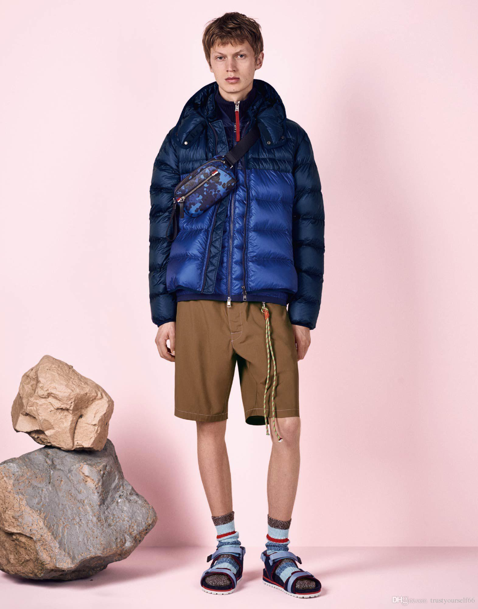

# 🌺 Spring Cleaning

Despite what the weather forecast might say, we are fully in the midst of spring 🌼

With that comes all the wonderful spring traditions you're used to: the return of allergies, the flooding of the streets, and the inevitable spring cleaning of your stuff in a moment of clarity motivated by Marie Kondo and finals procrastination.

  

Montreal spring fashion (where the rock is a pile of dirty snow)

And, just like you, the club had its own spring cleaning (of sorts)! 

Our club activities officially wrapped up with the [showcase](https://www.gamedevmcgill.ca/gdm-showcase-2019), which was a fantastic way to close off the year in good company with great games.  On the administrative side of things, we've been also tidying up this year and preparing for the year to come by choosing a new executive team. After a long and difficult week of interviewing and deliberating, we have chosen the new execs for next year.

I'd first like to thank the 2018-2019 exec team for all their hard work. They were a fantastic group of people to work with, and sparked much joy for all of us 🔥. 

(All past execs will be sticking around the discord after their tenure, keep an eye out for the Retired-Executive role 👴👵).

  

# 🚪 Opening New Doors

However, with all ends come new beginnings! 🎆

I am happy to present to you the GameDev McGill exec team for 2019-2020:

### Ness

Ness here! I’m a Comp Sci/Biology joint ~~gremlin~~ major who spends too much time thinking about video games when I should be thinking about studying instead. With vague knowledge ranging from Unity to Audacity, I might not have solutions for all your problems (see: Programmers), but am always up for research and discussion sessions for anything game dev. Most recently, I’ve been tinkering with 3D modeling and rigging in Blender. On my off-time, I’m a sucker for rogue-likes such as The Binding of Isaac: Rebirth, Crypt of the Necrodancer, and Risk of Rain 2. At GDM, I'm the head organizer for McGame Jam, our annual video game hackathon. ([Ask me](mailto:mcgamejam@mcgilleus.ca) how you can get involved as a volunteer!)

### Sam

Sam I am, green eggs and ham. I am starting my fourth year as a Mathematics and Computer Science double major focusing on computer games. I enjoy a range of fantasy games, as I always end up spending hours following the chickens in Zelda or finding another side quest to waste my life away. On the game development side, I am interested in gameplay programming and the math side of programming. As the lead programmer next year for the club, you'll see me around tutorials and workshops. Ask me anything about programming, math, or the necessity of chickens and other (not useless) animals in video games. 

### Seleste

¡Hola, soy Seleste! I’m a History major (minoring in Comms and Sociology) entering my U2 year and one of the two new VP Communications! When I’m not reading true crime books, writing last-minute stories at 2am or quite literally inhaling coffee, I’m usually messing around in Photoshop/Illustrator, trying to make pretty things. My favorite video game genres include horror, dystopian & simulation-type games (think: Outlast, Fallout, Sims/Civ V), but any game with a cohesive story is enough to win me over. My favorite game dev things to talk about is narrative designing, how much I hate Blender, and my massive appreciation for indie devs (see: Steve Gabry/Portable Moose, Airdorf, Killmonday Games).

### Filipe

A warm welcome! I’m Filipe, a U3 Physics and Comp. Sci. joint major who enjoys learning and sharing ideas, including those which extend beyond the limits of my major. I am always eager to share my passion of games like The Witcher 3, Farcy2-4, AC and Sleeping Dogs; the games industry really is an evolving media with much artistic depth. I have enjoyed seeing our community get together for the monthly events and for McGame Jam 2019, which I was happy to be a part of as a volunteer. I therefore wish to contribute as much as possible to foster a fun, social and inclusive community here. I am your friendly VP Internal here at GDM and will be hosting all of our club’s social events.

### Lor

Hey I’m Lor, a CS kid entering U3 in the fall. 👋 I’m into CMS-type games (Prison Architect, RimWorld) and recently dug myself into a deep hole of battle royales (namely Fortnite lmao). At GDM, I’m your friendly VP Coms, sending endless notifs about all things game dev. You can find me almost always on Trottier third floor. 

### Jack

Hey, I'm Jack. I will be a Software Eng graduate student starting in the fall focusing on computer graphics. Most of my time is spent either rendering cool things or playing MMOs (my favorite being Guild Wars), the latter of which I hope to help make one day. As an associate programmer at GDM, you can always come to me with programming questions, I especially likes ones about shaders. Looking forward to helping people out and learning a few things myself along the way!

### Alain

Hey, Alain here! I am a U2 Software Engineering student. I am the VP Finance of GDM, which is a fancy term for me filling up your cheque requests after you make a purchase for the club, and keeping track of the budget. I basically grew up playing games, and sometimes I'd find myself replaying them to reminisce my childhood in a way (GTA Vice City, Crazy Taxi...). I barely have any experience working with game engines, so I'm looking to learn that over the summer. If anyone willing to join hmu!

### Jim

Hey, this is Jim! I'm a U2 Computer Engineering student and the new VP Admin! You can hit me up whenever you want to rent equipment or play Smash. I'm taking DPM next session so you know where to find me :'). I'm a big fan of Open World games (BOTW) and 4X games(Europa Universalis 4). I'm also down for any tabletop games like Catan, Secret Hitler, San Guo Sha(expect an hour of explanation if you wanna know what's the later). I'm also a programmer in Unity and Unreal, you can come up to me whenever you have questions. Cheers!

### Michael

Hey I'm Michael! I'm a U4 Software Engineering student at McGill, and will be the president of GDM next year! I was also the Lead Programmer for the club for the past 2 years, where I gave various workshops and tutorials! My interests mostly lie in graphics/engine programming (especially open world environments!), and I love playing competitive games (csgo, overwatch,etc - although I'm not very good anymore :/ ). I'm extremely excited to be leading this amazing new exec team next year. We have a ton of new talented people and a lot of new goals, so I can't wait to see what the club accomplishes! 

### Brendan

Hi I’m Brendan! I’m a U3 Software Engineering student here at Mc-Grill and one of your Associate Programmers for next year! I’ve been playing games since I was little (Crash Bandicoot fans represent) and, in recent years, have found a love for programming. Game dev naturally ticked both boxes :) My favorite game atm is Rocket League (even though I'm trash), with my all time favorite being Fallout 3. I’m particularly interested in engine development, with a skew towards core networking tech (especially the multiplayer systems behind large-scale FPSs and MMOs). I’m excited to help anyone who has questions and to also learn from you all as well.

### Michel

Hey I'm Michel! I'm a U3 Software Engineering student at McGill, and I'll be VP External for the upcoming year 2019-2020! I love the production industry and games are a big part of it! I've started experimenting recently with game development and it's definitely starting to grow on me. I'm especially interested in how games are designed, from the game environment itself as well as the storyline. My favorite games are definitely Assassin's Creed and Uncharted 3 and I also love first-person adventure games like Firewatch and in the Valley of the Gods! I can't wait to see what the next year holds for GameDev McGill, and I'm super excited to see what I can learn from everyone on the team!

# 🚀 Thanks For All the ~~Fish~~ Games!

On behalf of this year's exec team, I'd like to thank all of our sponsors who supported us: Ubisoft Montreal, the Engineering Undergraduate Society, and MESC. Most importantly I'd also like to thank all of the members of GameDev McGill for making this community as great as it is. 

On a personal note, I'd like to thank everyone who has supported us over the past four years. 

In running McGame Jam and starting GameDev McGill, I hoped to build and foster a **community** which I wish had existed when I first joined McGill. 

A community of all the *talented and creative* students learning from each other and inspiring each other.

A community with proper support access to the resources it needed to grow. 

A community which could help highlight the *amazing talent* we have at McGill.

A community which could help foster game developers to be the best they can. 

While we've had our ups and downs, I am incredibly proud of the community we've built together. I'm constantly impressed and inspired by everyone's creativity and hard work, and I've made some great friends along the way.

  

Fun fact: I had to stall that presentation until the 50 chickens we ordered arrived and were ready to be served 🐓

These past few years have been a wild ride of events: from securing last minute funding for gamejams, to fixing leaky ceilings. (Also at some point someone made [a game about me?](https://projeffboy.itch.io/lets-find-elie) That was something). It's been an awesome and humbling learning experience running this enterprise. 

I'd like to thank everyone without whom this would not have been possible, including all the execs and volunteers who I've had the pleasure of working with over the years, and the countless others who supported us in our endeavours. I'd like to particularly thank all the members of our community without whom this club would just be me talking to a Pikachu plush all day. 

Goodbyes are always a sad affair, but I leave with the confidence that the incoming exec team and all our members will continue making our club a great place to make games. 

So long and thanks for all the games!

-Élie