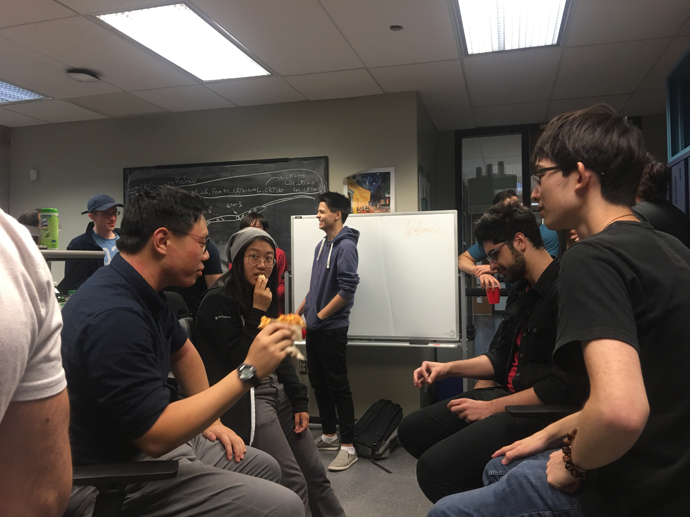
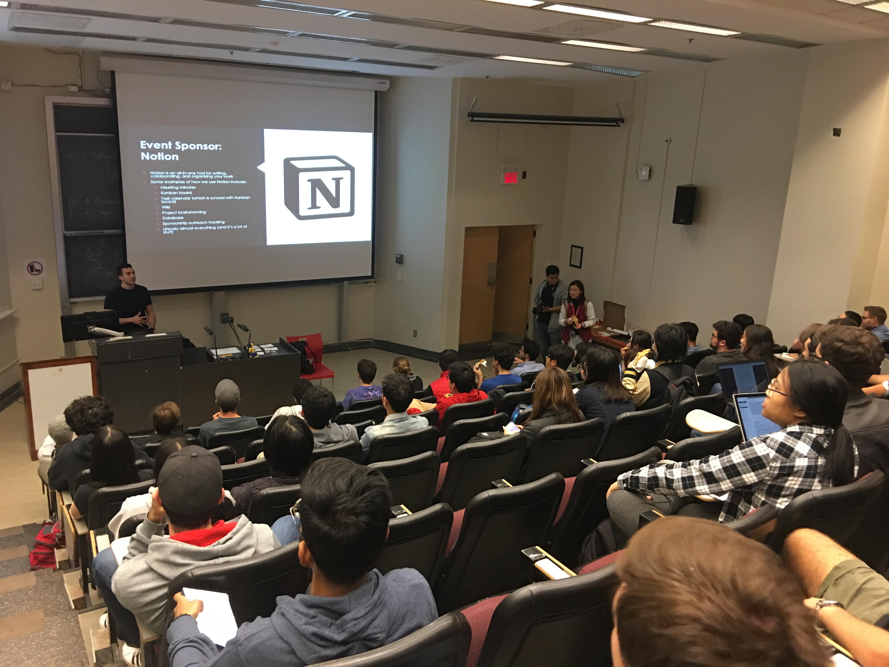

New year, (kinda) new us. As most clubs usually do at the start of each semester, GameDev McGill started with a bang. In three weeks, aside from the various meetings we've held, we've tabled four times, hosted an Opening Night, held our Info Session, and joined some clubs for a fun Trivia Night. The ball's rolling and has yet to stop, but we're taking a moment to recap; it's always fun to look back and reflect! 💫

# 🗣 Tabling
## (EUS Involvement Day, SSMU Activities Night, CS Activities Night)

We've tabled at three events in these past weeks: EUS' Involvement Day, SSMU's Activities Night, and CS' Activities Night. We're excited to have met so many of you! There's nothing better than seeing so many enthusiastic faces, even if some of you just stopped to watch the demos (we love that too). Thank you to everyone who stopped by to say hi!

# 🦕 Opening Night

Opening Night! What is it? In essence, at the beginning of a semester, we invite our current members to come visit our club space in the Factory. The event is meant to help them reacquaint themselves with not only the space, but also the resources we have, meet the new execs, and just hang out for a while. It was a small get-together after a long day of classes to say hi and eat some pizza 🍕

Thank you to all our members who came! It was great seeing so many familiar faces again, and even greater to see how everyone reconnected (or connected for the first time). We're excited to see how the rest of the semester'll go 🚀

# 👋 Info Session

An event usually held at the beginning of every year, our Info Session is meant for every McGill student out there who's interested in joining our club. It's the introduction to who we are, what we do, and how we do it. We don't recruit again until the start of the winter semester, so if you were interested in joining us, this was the event to be at!

Quick shout out to our event sponsor, Notion (subtle plug: their premium plan is free for students and educators! Check out the info [here](https://www.notion.so/students)) for covering the pizza and location! We hope the talk was both informative and enjoyable to all who came. We released the intro tutorial shortly after the event (more info can be found on our Facebook page), as well as our office hours, so be sure to check that out if you're interested in joining us! 🤓

# 🧠 Trivia Night

TRIVIA NIGHTTT 🗣🗣🗣

A fusion between four computer science clubs, including: yours truly (GameDev McGill), McWics, Compete and McGill AI. This event was open to all who answered the Google form to sign up. Participants got to meet new people and have friends join in their team to answer a series of coding and Comp. Sci. culture questions. It was a blast — equipped with free pizza, every participant had the opportunity to meet several McGill Comp. Sci. clubs as well as make new friends, and the winning team even got individual prizes! This even brought the participants and the organizers closer in similar fashion: by solving things and having fun 🕵️‍♂️

Stay tuned: a future Trivia Night might just be in the works 🔍

# 🔜 Upcoming Events

All in all, its been an eventful past few weeks — it can only go up from here! With the release of our roll-a-ball tutorial, we'll be making decisions on new members quite soon, and that's when most of our favorite events will take place, such as...

🔸  **Intro to Game Dev talk**: Presented by our current president, Michael, this is a must-attend for any and all of our members who are just starting off in game dev. He'll be going over the basics, including recommended game engines, creating components, and much more. 

🔸  **Monthly Socials**: Among the most memorable of our events is our Monthly Socials, where members come together once a month to show off their projects. In the past, these have included both full games and works-in-progress, but all get plenty of love. It's a great time to get to know fellow members, and make plans for the next Social!

🔸  **Boot Camp**: A new series presented by our Tech Team (including Sam, our lead programmer, and Brendan and Jack, our associate programmers), our Boot Camp will focus on making an RPG (using pre-existing art assets). The Boot Camp will involve learning how to incorporate mechanics into the game such as movement, picking up items, inventory, equipping, combat, stats, UI and much more!

🔸  **Show & Tell**: Another new event, this time for showing off your favorite games. Doesn't have to be one you've made — if you, like me, love Fallout: New Vegas, or Stardew Valley, then you'd come in with a little game trailer or gameplay montage and talk about what makes it great, or talk about your favorite mechanic, character, monster, location, lore — the list is endless. A smaller event, our goal here is to give us all a tighter sense of community by sharing our favorite aspects of our favorite games.

...and, of course, more! But that's our secret (for now 😎 )

Thanks for reading! From us to you: have a great week! 💛
