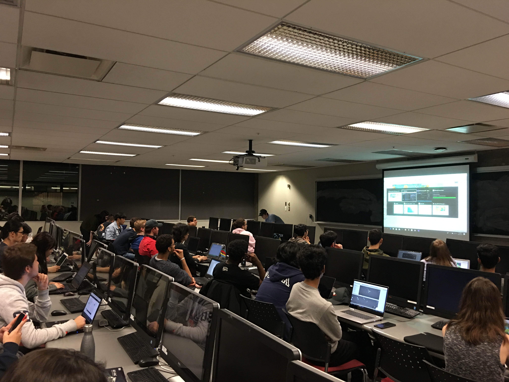

# New faces, new tech & a warm welcome

Our second blog post of the school year is here! It's been a really (read: *really*) busy few weeks, what with our new members joining us (over 50!), a whole blitz of internal and external events, and much more. Here's our biweekly recap of what's been going down:

## GameDev Social 1

A few weeks ago, our new and old members joined us for an evening in the EUS Common Room for our staple event: GDM's monthly social! Our theme for this social was *Harvest;* however, being our first social of the year, we took the opportunity to showcase some past games and introduce Ubisoft Game Lab Competition to our members. It was a good hour in the Common Room with snacks, good laughs and good people. We're excited to see what our members come up with for our following Social (the theme being *Lantern*!)

## Boot Camp 1 & 2

So far, the first three boot camp sessions have come and gone! For those who do not know, we are in the middle of running a beginner 5-week series for game programming. Our Boot Camp focuses on making an RPG using pre-existing art assets and teaching fundamentals of gameplay programming. In the first two sessions, a member of our Tech Team, Brendan, went over character movement, camera controls, object interactions, UI, and an inventory system. The previous session, Jack continued the inventory system to handle equipment. The next two weeks will focus on combat, taught by Sam. It's a great way for our new members to scratch the surface of game development and improve their coding skills.

## Unity Developer Day Montreal 2019

Unity Developer Day Montréal, which took place on the 2nd of October, was a great event! Many of our games from past monthly GameDev jams were on display. There was some new Unity updates and tech announced, including everything from new improvements to AR to a new VFX pipeline that rivals some of the best particle systems in other game engines (best of all, not only is it versatile for coders, but artist friendly, too, with a menu system to help!) Our participating members loved it and were very excited to show off their games!

## Ubisoft @ McGill

A couple of weeks ago, McGill had the opportunity of hosting several Ubisoft Montreal recruiters and developers! This event was a great way for students to connect directly with Ubisoft employees to learn about what kind of work they're doing, as well as to learn about employment opportunities. This was the second year that GameDev McGill helped advertise this event (which was hosted by McGill), and it definitely won't be the last! Our club founder Élie Harfouche, who is now working full-time at Ubisoft, also made an appearance ;)

## Ubisoft Tech Talk

Last but not least, we had the pleasure of collaborating with the McGill Engineering Student Centre (MESC) for a technical talk presented by Ubisoft employees! The talk ("Putting out Fires: Engine Programming"), presented by technical engine leads Joël Michaud and Vincent Bherer-Roy, described the important role that engine programmers play in the development of modern AAA games. This was an amazing opportunity for students to learn more about what kind of challenges technical positions in the game industry face, as well as learn directly from industry veterans. Thanks Ubisoft! 

## 🔜 Upcoming Events

So, what's next? Check out some of our upcoming events below! 🤩

🔸  **Intro to Graphics**: A recurring talk and one with always high attendance is our Graphics talk, where we explain some fundamentals of Computer Graphics for all our graphics enthusiast members. We will be going over the basics, including how the visual components of game objects are represented, how these representations get projected onto your screen when they're displayed, and much more. 

🔸  **Ubisoft Game Lab Competition**: Ubisoft hosts a 10-week competition every winter semester where two teams from each participating Quebec university creates a game prototype based off of a theme. It is open to any full time student, no matter if they are from McGill or not! Check out our information session for more information about how to participate for McGill or if you cannot make it, the technical team in the club can fill you in. Its a great way to get a polished side project done while repping for McGill!

🔸  **Monthly Socials**: Our Monthly Socials, where members come together once a month to show off their projects has its second installment this month with *Lantern* as its theme. This event always lightens the mood; it's the perfect setting to get to know each other within our club, and make plans for the next Social!

🔸  **Boot Camp**: Our new series presented by our Tech Team and focused on teaching members Unity by making an RPG (using pre-existing art assets) is wrapping up. With the final half left, members are now much more comfortable with game development through engines like Unity. A big thanks to our members for offering continuous support and input as it helps make this learning experience accessible and concise!

🔸  **Show & Tell**: A new talk series where innovative techniques in video game development are shown along with a behind the scenes explanation of how these techniques have created some of our most beloved games like Hellblade: Senua's Sacrifice, the Witcher, Horizon Zero Dawn and many more. Our exec team will get the ball rolling, but ultimately members of the club will submit a topic and enrich our communities learning experience and appreciation of games as a technical marvel and an artistic medium.

Thanks for reading! 💛

Until next time,

GameDev McGill's Exec Team