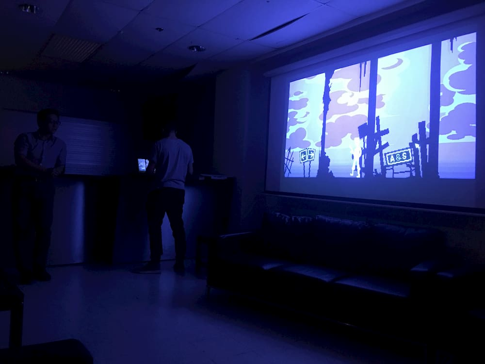
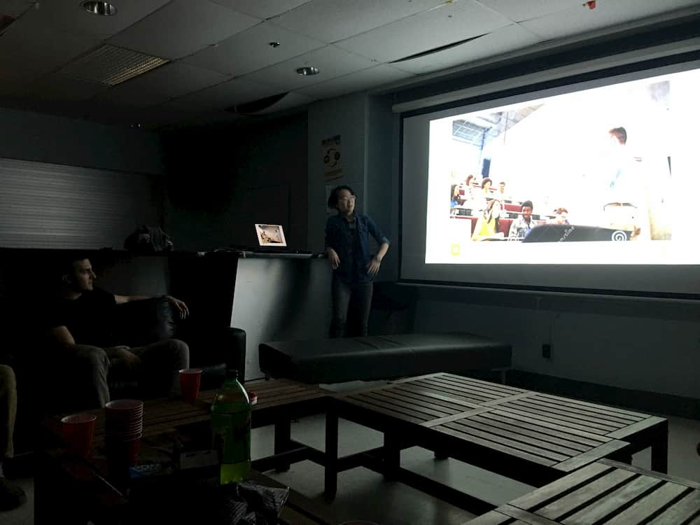

2019 is coming to a close, which means a whole decade is, too. Kinda crazy, huh? Not even sure if I'm ready for 2020, but hey, that's life: eternal uncertainty about everything.

Three months of go, go, go-ing (vroom vroom 🏎️💨) has resulted into a multitude of events for us over at GameDev McGill. As the fall semester comes to an end, so do our events; a special shout out to our members who have participated in any and/or all of them! From our Show & Tell to our Social, we're happy to have gotten to know so many of our members this semester. We're excited to see what the winter semester's gonna bring us, and we hope you are, too!

## GameDev Social 2

<p align="center">
  
 </p>

A big ol' shout out to the members who made a game, a prototype, presented an idea — there's nothing more inspiring than seeing our members sharing their unique and creative approaches to game dev! Our second Social took place on Nov. 11, with the theme of 🏮 Lantern 🏮 . We got to see a couple of cool ideas come to life — in case you're curious, go check out this month's [itch.io](https://itch.io/jam/game-jam-monthly-october-2019) page!



<font color="#5f5f5f">_Among all the presentations was [The Sallow](https://mrfufu.itch.io/the-sallow), a fun mini-game where the main enemy was composed of three different lanterns!_</font>

We've been asked as to whether we'll be hosting one more Social before the year ends, but unfortunately, due to time constraints, we've decided not to. But fret not! We'll be announcing shortly what we're planning to do for this upcoming month & January 😎

## 👶 Extra Life Stream

<p align="center">
  
 </p>

Our **Extra Life Twitch Stream** (where we broadcasted ourselves playing games for charity) was a huge success! We set out to make a 24h fundraising stream for Enfant Soleil, a local hospital charity for children, through Extra Life and surpassed our initial goal of 100$ USD; in total we managed to raise 145.72$ USD. We wish to thank everyone who donated, showed their support — whether by physically streaming, participating remotely as a viewer, or shared the event information — and to our sponsors Ubisoft and EA for helping make this fundraiser possible.

P.S. [We have a Twitch account](https://www.twitch.tv/gamedevmcgill)! Follow us and turn on your notifs to catch our random streams 💃

<p align="center">
  <iframe
      src="https://clips.twitch.tv/embed?clip=PlayfulUnsightlyEelTwitchRPG"
      width="80%"
      height="320px"
      allowfullscreen="true">
  </iframe>
</p>

<font color="#5f5f5f">_Outlast: just as scary as it was back in 2013 👻_</font>

## 🎭 Show & Tell

<p align="center">
  
</p>

**Show & Tell** was a new event this year! It's aim was to be an event where we could show our appreciation for games (specifically: what makes them great & why they perform so well as both artistic works and products) in a discussion-based setting. Members shared games that they hold dear and explained how innovative story telling, audio-visual techniques, game design and meticulous planning around player agency propelled these games to hold a cult status as gaming classics and influenced the medium greatly. Some of the games presented were Obra Dinn, Hellblade: Senua's Sacrifice, Skyrim, Fallout 3, Horizon Zero Dawn and Red Alert 2. We are thankful to have such a tight-knit community of devoted and inspired members! ❤️



<font color="#5f5f5f">_feat. Mountain Dew, AKA gamer fuel™️_</font>

## Boot Camp Series

```
public class BootCamp
 {
   Debug.Log("Game Over");
 }
```

Five weeks and hundreds of lines of code later, the **Boot Camp** for 2019 disappeared just as fast as my grades. Thank you to everyone that showed up to the tutorials, especially at the fancy new FDA rooms in the last few tutorials. It was great being able to give endless tips and tricks that we wish we knew early on in learning game development. We hope that you can all show off these skills at various other events (sneak peek, McGame Jam below)!

## 🐧 McGame Jam 2020

We're excited for 2020 for a lot of reasons, and one of the big ones just happens to be...

wait for it...

🥁🥁🥁🥁

**MCGAME JAM**!!

In other words, our yearly staple event! It's a 48hr hackathon hosted over a weekend, and this year, we're hosting the event on _campus_. We're also being sponsored by Ubisoft and EA! We went fully live just this week (in case you haven't heard yet) so if whether you're one of our members or a person just passing by, go check it out, I promise it's a blast. [Here's](https://www.facebook.com/events/476282433234589/) the link to our FB event — go RSVP!

As always, we wish you all the best, and happy holidays! ❄️

(also, have a blessed finals szn — y'all got this!!)
