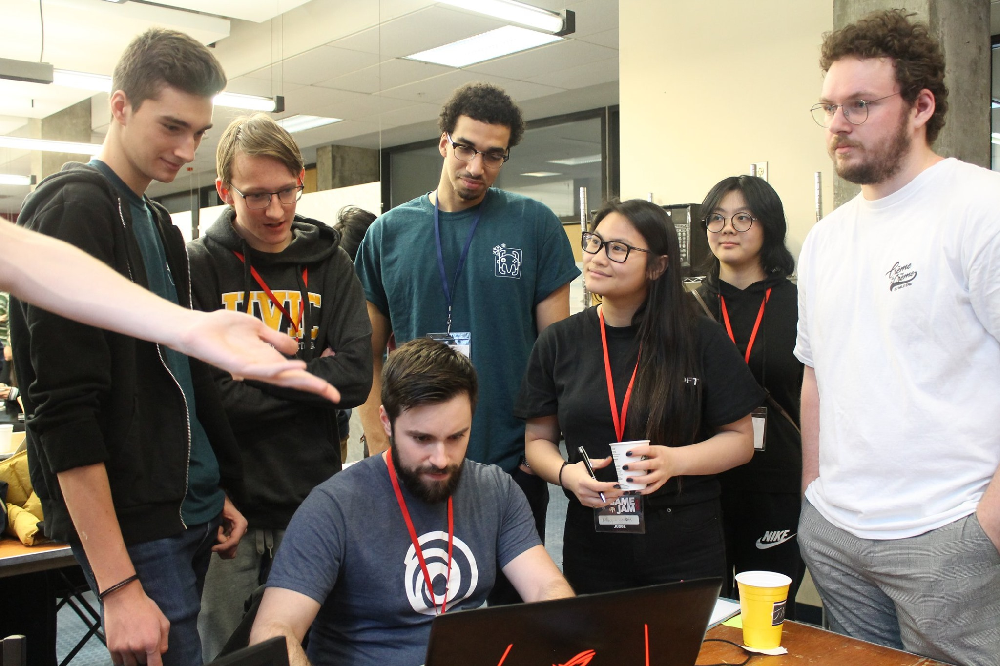
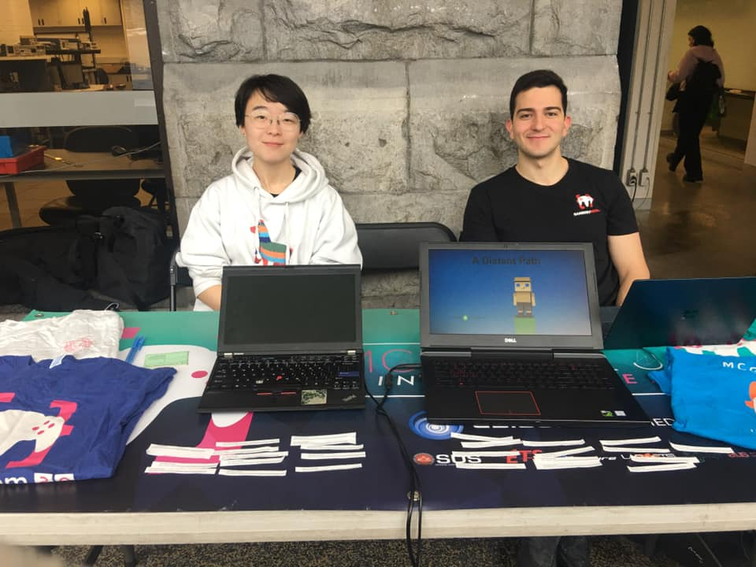
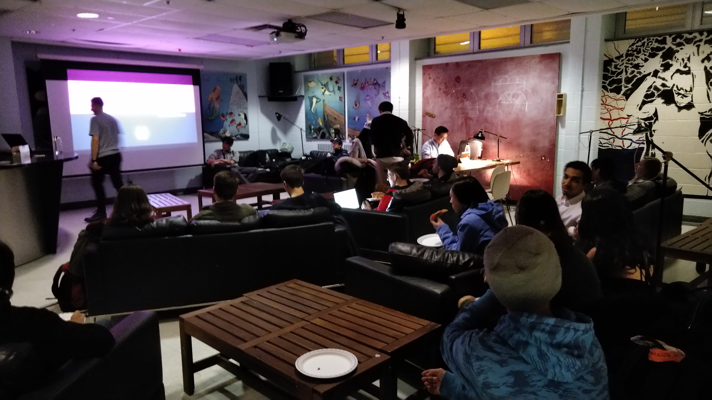

  

Hey. How's it hangin'?

It's a new semester! New year! New decade! Check in on yourself, your friends, your families, your resident stray cat. Winter's never an easy time, what with the lack of sunlight and all, and it's easy to just give in and stay in bed (especially if, like in my case, the piles of snow outside your apartment are twice your height). Hopefully this semester hasn't been too rough on you, but if it has, stay strong — reading week's just around the corner 👀

GameDev-wise: It's been a busy first month for us! If you're interested in finding out just how busy, keep reading!

## ⛄ McGame Jam 2020

This year, we changed things up and held our staple event, McGame Jam, a little earlier. McGame Jam 2020 took place the weekend of January 10-12, and it was a blast! For the theme of "Can't Go Back", the event got plenty of creative cogs turning. We want to extend a huge thank you to everyone who helped make this jam a reality — our sponsors (and mentors), who include Ubisoft and EA; our 150 participants, who, over the course of 48 hours, produced some incredible games; and our volunteers, who helped keep everyone and everything running smoothly, regardless of the hour.

We're so happy to have had the pleasure to host McGame Jam for its sixth year, and are already thinking of the next one. We hope you guys enjoyed it, and hope to catch you all next year!

## 💬 Info Session, Recruitment, & Tabling

As we usually do every semester, we did our usual rotation of tabling, including being at EUS Involvement Day & SSMU's Activities Night. We loved meeting so many of you! We always appreciate the opportunity to show off our members' games and hope you guys enjoyed it as well :)

Post-tabling, we released our intro tutorial and gave prospective members two weeks to complete & submit their projects. We encouraged them to put their own spin on it, regardless of what position they were going for, and we got some pretty nice submissions (including a Shrek-themed one, which already gets a 10/10 in my book). We're happy to have accepted new members into the fold, and can't wait to see what they'll make!

## 🕹️ Night at the Factory

  

Night at the Factory is a little event we hold every semester, usually post-Info Session, for our members to come together and reacquaint themselves with our club space, the Factory. This time, we had a good number of members stop by to say hey and grab a slice of pizza. Hello's were exchanged, convos were had, friendships were born, and the Factory (our club space) was buzzing with activity! As always, we kindly encourage all of our members to come by during our office hours to hang out and make some games. 🎮

## 🎮 Ubisoft Industry Tour

  

The Ubisoft tour was fun, to say the least. During this external event, we learned that Ubisoft Montreal is the biggest game development studio location (as far as team size) in the world, and it shows. From the camera/3D scan room (where every pore of an actor's face is saved) to the silent management section through the loud and proud bustling Rainbow 6 Siege floor to the testing rooms and down to the food truck lunch rooms, this was a tour not quite expected but all loved. We hope that those in awe and those passionate to get a start with Ubisoft as interns apply in droves; best of luck to you!

## 🍕 Social 1

Our first Social of the semester was a total success! With the themes creepypasta and alien, we gave our members roughly two months to come up with a prototype or finished game that followed (or didn't!) the theme. We were happy to hear that everyone enjoyed the small get together, and are excited for our next Social — one we're doing with ETS' Conjure and Concordia's game development club!

  

## 🔜 Upcoming Events

**Graphics Talk**

Instead of a Boot Camp series, this semester, we're planning on holding a series of talks, given by our beloved Tech Team! The first one, a talk on Graphics, will be given by our resident elder (👴) Michael, who will be going over the basics of graphics and why they're so important in game development. Not a talk you want to miss!

**Games Night feat. ECSESS**

In a discord poll that went down not too long ago, a lot of our members mentioned that they wanted to do a games night. Hey, you talk, we listen: we're collaborating with ECSESS for an evening in the Trottier Lounge to have a games night! More info about this will come soon to the Discord & Facebook, so keep an eye out.

**Social #2 feat. ETS & Concordia**

A social, but make it big[ger]. We're collaborating with two clubs from different universities to bring you the _biggest_ Social yet. Get hype!!

**24hr Stream, take two**

Your resident factory gremlins, Seleste (that's me!) & Ness will be doing a second twenty-four hour stream late Feb (i.e., just before Reading Week kicks off, so you're morally and contractually obligated to tune in). After the success of our Extra Life stream last semester, we've had some people ask about when we'd be holding our second one — hence, take two! We'll be bringing you even _more_ wholesome memes, Sel's disembodied voice perpetually lurking in the background, Ness refusing to play horror games, our members taking over, and our other execs popping in. It'll be great. Don't miss it!
